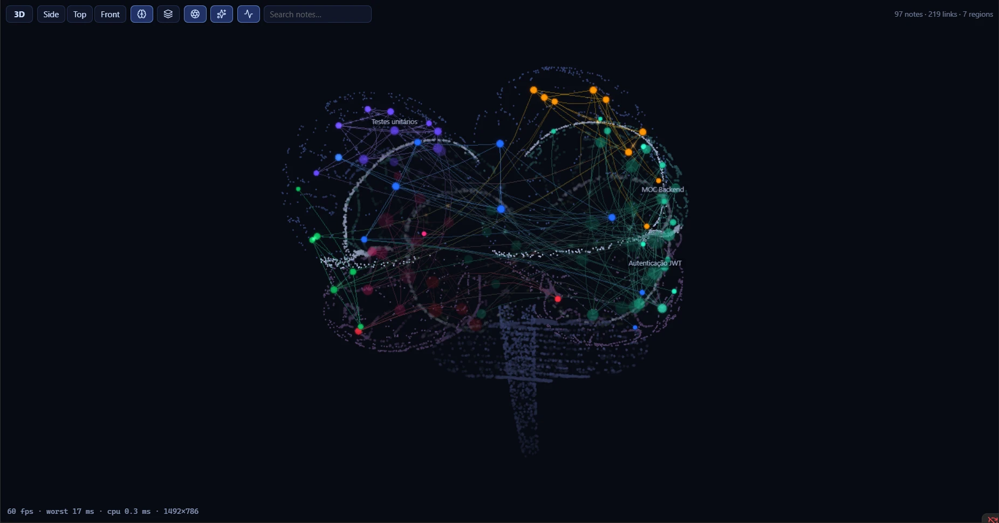
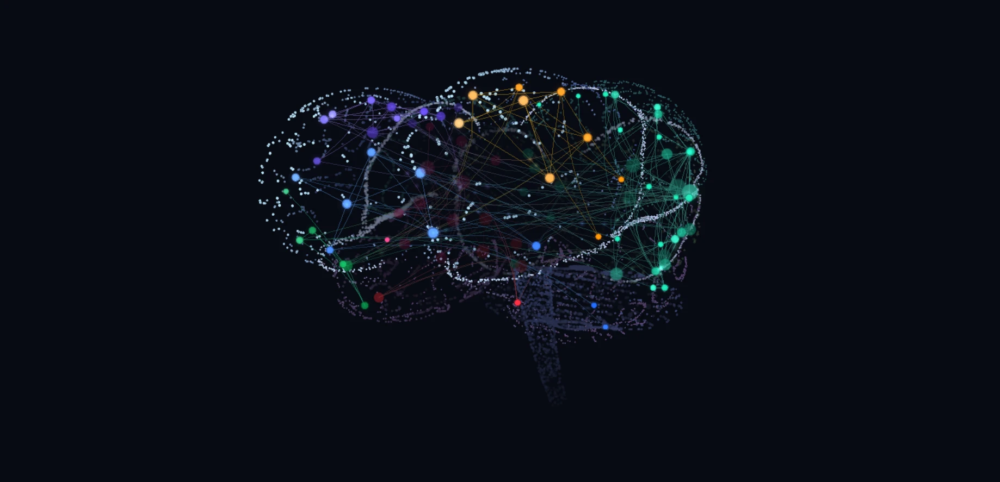

# Brain Graph

An Obsidian plugin that draws your vault as a brain, in 2D or 3D. It's a lightweight alternative to the core graph view.



- **Neurons:** each note is a point on the cortex. The 10 most connected notes always show their names.
- **Regions:** each community of notes (detected from links) or each top-level folder becomes a region of the cortex. Tightly connected groups sit next to each other.
- **Orphans:** notes without links live in the cerebellum.
- **Fibers:** the links. With the surface off (default), they dive toward the center like white matter. With the surface on, they arch over the outside.
- **Stable map:** positions are saved, so the brain always opens the same way. New notes land near their neighbors without shuffling the rest.



## Installation

### From Community plugins

1. Open *Settings → Community plugins → Browse* and search for **Brain Graph**.
2. Select **Install**, then **Enable**.

### Manual

1. Download `brain-graph-X.Y.Z.zip` from the [latest release](https://github.com/HernanJr0/brain-graph/releases/latest).
2. Extract it into `<vault>/.obsidian/plugins/`. You should end up with `.obsidian/plugins/brain-graph/` containing `main.js`, `manifest.json` and `styles.css`.
3. In *Settings → Community plugins*, reload the list and enable **Brain Graph**.

Open it from the brain icon in the ribbon or with Ctrl/Cmd+P → "Brain Graph: Open graph view".

On first open, the plugin computes the layout (a few seconds, depending on vault size) and writes `layout.json` to the plugin folder. Later opens are instant.

When updating manually, replace the files and **restart Obsidian**. Toggling the plugin off and on with the new version may fail to load.

## Usage

- **Navigate:** drag to orbit (3D) or pan (2D), scroll to zoom. Click a note to open it; Ctrl/Cmd+click opens it in a new tab.
- **Graph toolbar:** switches 2D/3D, jumps to side, top and front views, toggles cortex, surface, depth of field, glow and ambient pulses, and has a search by note name.
- **Commands:** "Open graph view", "Recalculate layout" and "Toggle 2D/3D".

### Settings

| Option | Default | What it does |
| --- | --- | --- |
| Default mode | 3D | How the graph opens |
| Group regions by | Links | Link communities or top-level folder |
| Show orphan notes | on | Notes without links in the cerebellum |
| Brain surface | off | Dark surface with notes on the outside, instead of the point cloud |
| Depth of field | on | Blurs and dims what is behind the center |
| Show cortex | on | Anatomical outline: fissures, sulci, lobes, cerebellum and brainstem |
| Node glow | on | Halo around notes |
| Hover pulses | on | Signals run along the links of the hovered note |
| Ambient pulses | on (45) | Slow signals all the time |
| Idle animation | on | After about 1.5 s without input: a wave of activity, breathing glow, and the interface fades out |
| Idle orbit | on | The camera slowly orbits while idle (3D) |
| Node size / Hub labels | 1 / on | Appearance |
| Recalculate layout | — | Lays everything out again from scratch |

## Performance

The plugin is built to run at 20 fps or more on integrated GPUs.

- **On-demand rendering:** it only redraws when something changes. For zero cost while the brain is still, turn off **ambient pulses** and **idle animation**. With either one on, the loop runs at about 30 fps.
- **Auto pause:** rendering stops when the tab is hidden.
- **Finite layout:** the layout converges and stops, with O(n) repulsion via a spatial hash. The result is stored in `layout.json`.
- **LOD:** depth of field reduces detail in the background.

## Privacy

Brain Graph works fully offline. It reads your notes' links through Obsidian's metadata cache, makes no network requests, and only writes `data.json` (settings) and `layout.json` (positions) inside its own plugin folder.

## Development

Requires Node.js 22 and npm.

```bash
npm install
npm run dev      # watch → main.js with sourcemap
npm run build    # type-check (tsc) + minified build
npm run deploy   # build + copy to a test vault
```

`deploy` uses the path given as an argument, or the `BRAIN_GRAPH_VAULT` variable, or `~/Documents/BrainGraph-Teste`. For a path with spaces, call `node dev/deploy.mjs "<vault>"` directly.

### Preview outside Obsidian

`dev/preview.ts` renders the brain with a fake vault in the browser:

```bash
npx esbuild dev/preview.ts --bundle --format=iife --outfile=dev/preview.js
python -m http.server 5178   # open http://localhost:5178/dev/index.html
```

URL parameters:
- `n`: number of notes (default 1500).
- `clusters`: number of groups.
- `orphans`: fraction of orphan notes.
- `mode=2d`.
- `view=superior|frontal`.
- `cloud`: no surface.
- Effects to turn off: `nodof`, `noglow`, `noambient`, `noidle`.

### Measurement scripts

Bundle with `npx esbuild dev/<script>.ts --bundle --platform=node --outfile=dev/<script>.js` and run with `node`:

- `dev/bench.ts`: graph and layout time with 1.5k, 8k and 20k synthetic notes.
- `dev/quality.ts [vault]`: on a real vault, measures link length, reopening, new notes and distribution per lobe.
- `dev/affinity.ts`: checks that connected communities end up as neighbors.

### Structure

| File | Role |
| --- | --- |
| `src/main.ts` | Plugin: view, commands, settings and persistence in `layout.json` |
| `src/view.ts` | ItemView: toolbar, search, opening notes, incremental rebuild |
| `src/graph-core.ts` | Graph from resolved links, with communities via label propagation |
| `src/layout.ts` | Affinity-based seeds, cortex slots by area, spatial-hash forces and projection onto the anatomy |
| `src/brain-shape.ts` | Procedural SDF anatomy: stylized hemispheres, sulci, cerebellum and brainstem |
| `src/renderer.ts` | Three.js: nodes, halos, fibers, pulses, surface, depth of field, idle animation and picking |
| `src/settings.ts` | Settings |

### Release

Releases are published by GitHub Actions (`.github/workflows/release.yml`):

1. Update `version` in `manifest.json` and `package.json`, and add the version to `versions.json`.
2. Commit, create an annotated tag **without a `v` prefix** (Obsidian requires the tag to match the manifest version exactly) and push: `git tag -a 1.0.1 -m "Brain Graph 1.0.1" && git push origin main 1.0.1`.
3. The workflow checks that the tag matches `manifest.json`, builds, and publishes `main.js`, `manifest.json`, `styles.css` and `brain-graph-X.Y.Z.zip`.

To republish an existing tag, use *Actions → Release → Run workflow* and enter the tag.

## License

[MIT](LICENSE)
